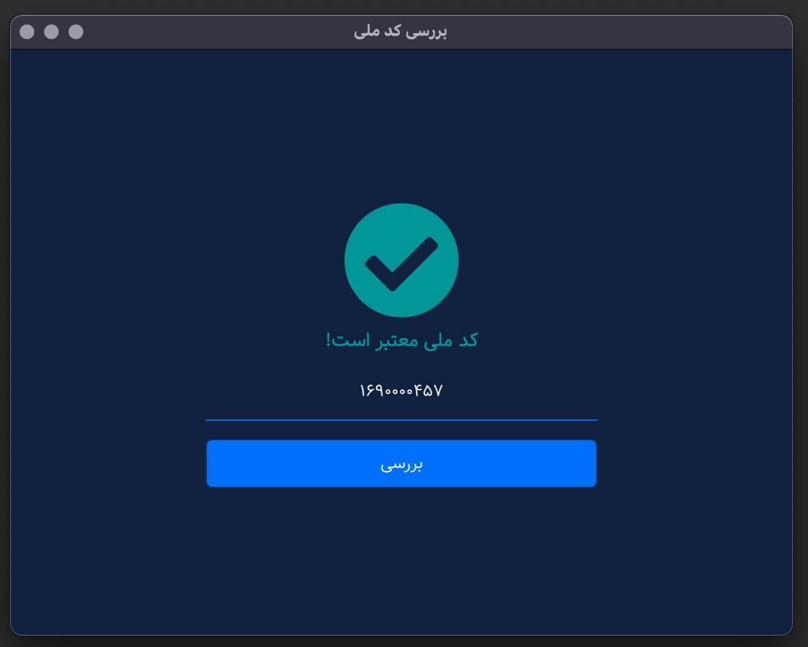

# Code-Melli Checker Desktop
A tool for validation Iranian national code.

### Features

- Easily check a code-melli is correct or no
- Cross paltform desktops (Windows, macOS, Linux)
- Soon...

### Supported and Tested platforms:

- [x] macOS
- [x] Windows
- [x] Linux

### Preview

| Correct        | Wrong          |
| -------------- | -------------- |
|  |  |

### Requirements:
- C++17
- Qt6 [Make sure you have Qt6.].

### Installing
Use the following commands:

- PLATFORM_OS = [Windows, macOS, Linux]

```
cd build
cmake -DPLATFORM_OS="macOS" ..
make
./CodeMelli-Checker
```
